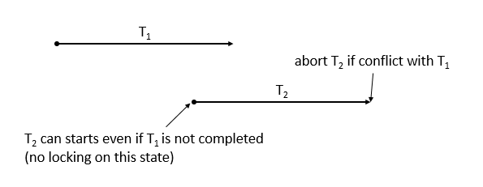

> [[Home]] ▸ **How it Works**

The mechanism of Haeinsa transaction is fairly straightforward.

### Design Principals

#### Speical Lock Column
 
Haeinsa manipulates special lock column which contains metadata of transaction on every row on HBase.
When changing columns on multiple row in a transaction,
Haeinsa client should acquire lock of every associated rows before modifying them.
Lock column stores transactional metadat of each row.

#### Optimistic Concurrency Control

Haeinsa uses [optimistic concurrency control], because it assumes low-conflict environment.
Haeinsa client only acquire lock in commit phase and abort transaction if others already acquired lock.

#### Two-Phase Locking

After finishing transaction, Haeinsa client releases locks to let other transaction could access those rows.
This is similar to [two-phase locking protocol], which has lock expanding phase and shrinking phase.

### Mechanism

#### Overview

Haeinsa transaction does not actually modify data on HBase before user explicitly call commit method, and client buffers them meanwhile.
However, user could see these modifications through normal `Get` and `Scan` operations
because Haeinsa transaction manager projects previous Put and Deletes of same transaction.

To implement multi-row transaction on HBase which only provides single-row ACID semantics,
Haeinsa uses `checkAndPut` and `checkAndDelete` API when modifying data.
While checking lock state and modifying data columns by single atomic operation, Haeinsa could achieve serializable isolation level.
Mechanism of Haeinsa is relied on causality of each step of transaction, not on globally unique id or strictly ordered timestamp like [Percolator].

Haeinsa stores lock on HBase column, so metadata of ongoing transaction is durable.
It makes fault-tolerant against client or HBase failure.
After failure, following Haeinsa transaction can clean up failed ones and roll back to consistent state.

### Resources

See other resources to understand how Haeinsa works.

- [Haeinsa Overview Presentation]

[two-phase locking protocol]: http://en.wikipedia.org/wiki/Two-phase_locking
[optimistic concurrency control]: http://en.wikipedia.org/wiki/Optimistic_concurrency_control
[Percolator]: http://research.google.com/pubs/pub36726.html
[Haeinsa Overview Presentation]: https://speakerdeck.com/vcnc/haeinsa-overview