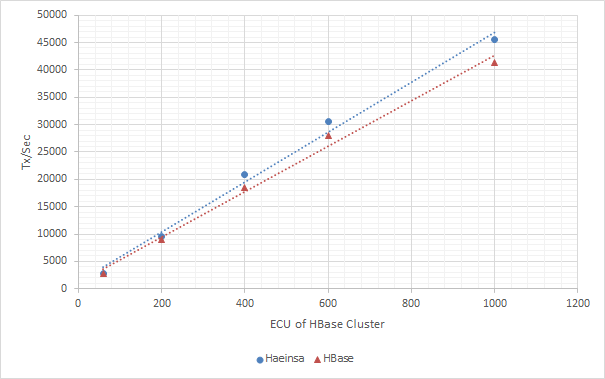
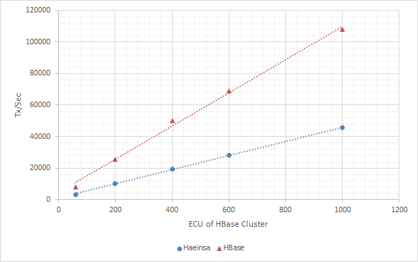
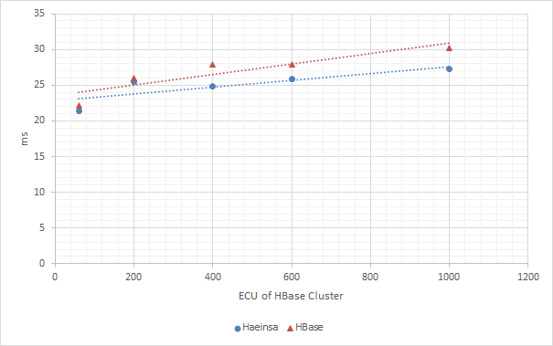
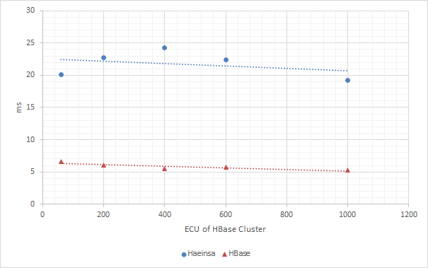
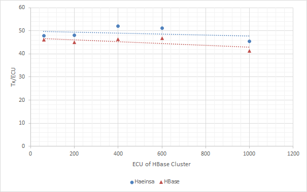
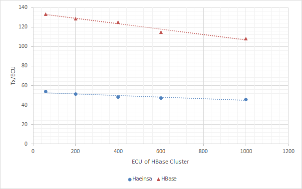

> [[Home]] ▸ **Performance**

We tested Performance of Haeinsa on AWS with c1.xlarge instance.
There are two type of transaction we tested.
Pratical transaction is simulation of most transaciton in our service.

- Practical Transaction = (3writes + 1read) * 2rows + 1read * 1row
- Worst-case Transaction = 1write* 2rows + 1read * 1row

### Linear Scalability

Throughput of Haeinsa transaction scales out as underlying HBase cluster scales out.
Linear scalability of throughput is tested against HBase cluster on AWS which have 20 ECU until 1000 ECU.
It is worth to mention transaction shows consistently low latency even when size of cluster become bigger.

***Tx/Sec graph of Pratical Transaction***

***Tx/Sec graph of Worst-case Transaction***

You can see that **Haeinsa is even faster than HBsse** on practical transaction test.
It is because Hbase does more RPC than Haeinsa.
Since Haeinsa applies writes on commit with checkAndPut operation,
If operations are gathered in a small number of rows, the better performance can be.

### Latency & Throughput Overhead

Haeinsa transaction has some latency and throughput overhead compared to raw HBase-only operations.
These overhead comes from additional CheckAndPut and Get operations when committing transaction.
Because Haeinsa use row-level locking, overhead varies on schema of database.

For example, one of major transaction used in practice
which referred as 'Practical Transaction' in following graph have slightly better performance compare to HBase-only case.
On average, various transactions used in Between experienced 6% latency overhead and 10% throughput overhead after migration.
Even in the worst case, Haeinsa transaction is slower than raw HBase-only operations only by 2~3 times.

***Latency graph of Pratical Transaction***

***Latency graph of Worst-case Transaction***

***Tx/ECU graph of Pratical Transaction***

***Tx/ECU graph of Worst-case Transaction***

### Conflict Rates

If conflict occurs during commit operation, Haeinsa throws ConflictException.
Conflict rate was about **0.004% to 0.010%** in our service.

To minimize request failure due to conflict, we retries the request with backoff if conflict occurs.
If maximum retry count exceeds, the request is failed.
In this case, request failure due to conflict dropped to about **0.0003% to 0.0010%**.

